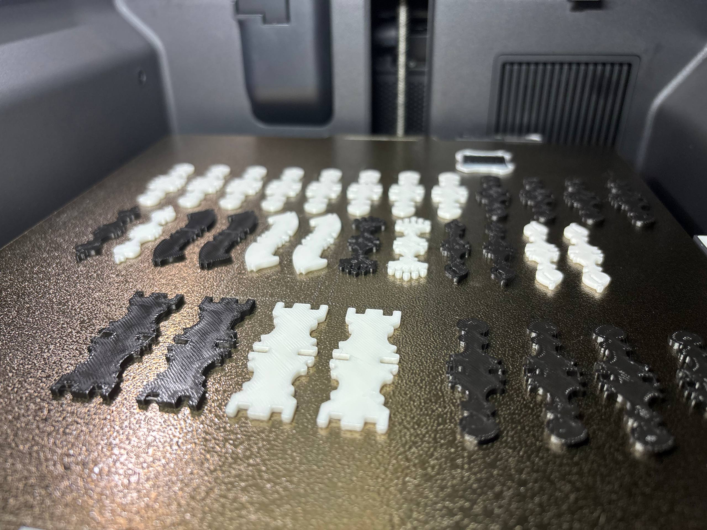

# Parametric 2D Chess Set (build123d)

A complete **2D chessboard and flat chess-piece silhouettes** generated entirely
from Python with [build123d](https://build123d.readthedocs.io). The project
reproduces the classic composition — an 8×8 cream/green board with the standard
opening arrangement, White at the bottom and Black at the top — as stylised flat
symbols rather than sculpted 3D geometry.

## Demo


## Already printed chess set




Each piece is available in three forms:

1. **Filled 2D face** — for rendering, SVG export, engraving or colouring.
2. **Outline** — closed boundary wires (or an offset ring) for laser cutting / plotting.
3. **Optional thin solid** — the face extruded into a flat token for cutting or 3D printing.

## Quick start

```bash
uv sync
python scripts/generate_all.py      # writes everything under output/
```

That single command regenerates all deliverables:

```
output/
├── svg/   board.svg, <piece>.svg ×6, initial_position.svg
├── dxf/   board.dxf, pieces.dxf, initial_position.dxf
├── step/  board.step, flat_pieces.step
├── stl/   <piece>.stl ×6
└── 3mf/   pieces.3mf            (with --3mf)
```

Flags:

* `--no-solids` — skip the STEP/STL extrusions.
* `--3mf` — also write a meshed 3MF for slicers (see *Bambu Lab* below).
* `--single-sided` — plain one-orientation silhouettes.
* `--fused` — compact point-symmetric figures readable the same way by everyone.
* `--style staunton|regence|selenus|bauhaus|glyph` — the piece design (default `staunton`).
* `--board small|medium|large` — 35 / 50 / 65 mm squares (default `medium`).
* `--figures small|medium|large` — how much of a square each piece fills.
* a positional argument sets the output directory.

```bash
python scripts/generate_all.py my_output --fused --board large --figures small
```

## Sizes

Board and figure sizes come as presets ([`BOARD_SIZE_PRESETS`](src/chess2d/parameters.py),
[`FIGURE_SIZE_PRESETS`](src/chess2d/parameters.py)):

| Preset | Board (square / playing area) | Figures (share of a square) |
| --- | --- | --- |
| Small | 35 mm → 280 mm | 73 % |
| Medium *(default)* | 50 mm → 400 mm | 94 % |
| Large | 65 mm → 520 mm | 100 % |

Figures always scale **with** the board, so a smaller board yields
proportionally smaller pieces; the figure preset is the extra size preference on
top. Any millimetre value still works directly via `ChessStyle(square_size=...)`
and `piece_scale`.

`python build_model.py` is a root-level shortcut for the same generation step.

## Figure modes

Every piece can be composed three ways, chosen with the `figure_mode` field on
[`ChessStyle`](src/chess2d/parameters.py) (a [`FigureMode`](src/chess2d/parameters.py)):

| Mode | Look | For whom it reads upright |
| --- | --- | --- |
| `SINGLE` | plain one-orientation silhouette | the near player only (upside-down for the opponent) |
| `TWO_SIDED` *(default)* | full figure + its 180° rotation stacked base-to-base, joined by a border neck | each player reads their own end |
| `FUSED` | only the identifying top (head/crown/mitre) merged with its 180° rotation into one compact figure | **everyone** — it is point-symmetric, so it looks the same from every side |

All three are **single connected pieces** — printable / laser-cuttable as one
element — and the two colours are told apart by fill only. `FUSED` fills the
square best (it isn't stretched tall like `TWO_SIDED`) while still being legible
to both players.

```python
from chess2d import ChessStyle, FigureMode, generate_all

generate_all(style=ChessStyle(figure_mode=FigureMode.FUSED))
```

The same `mode` argument is available directly on `make_piece`,
`make_piece_solid` and `make_piece_geometry`.

## Piece styles

Independently of the figure mode, pick the visual **design** of the pieces with
the `piece_style` field on [`ChessStyle`](src/chess2d/parameters.py) (a
[`PieceStyle`](src/chess2d/parameters.py)):

| Style | Look |
| --- | --- |
| `STAUNTON` *(default)* | the 1849 tournament standard: turned bodies, flared foot, beaded collar |
| `REGENCE` | early 19th-c. French: much taller and thinner, small heads |
| `SELENUS` | tiered German "pagoda" stacks of discs; rank read from tier count |
| `ST_GEORGE` | the pre-Staunton English standard: heavier, bulbous, ring-heavy |
| `EDINBURGH` | the abstract "North Upright" style: plain stepped columns |
| `BAUHAUS` | Hartwig 1924: the shape states the move (square rook, diamond bishop, circle queen) |
| `MAN_RAY` | the artist's 1920s set: sphere, cube, cone, scrolled knight, coiled queen |
| `GLYPH` | the flat figurine symbols from printed chess diagrams |
| `LEWIS` | the 12th-c. Isle of Lewis carvings: figural seated king/queen, rider knight |

Every style provides all six pieces in all three figure modes and is a single
connected face, so anything the default supports (SVG/DXF/STEP/STL/3MF, the size
presets, the material report) works for every style. The generators live one per
file in [`src/chess2d/styles/`](src/chess2d/styles); the
[`STYLES`](src/chess2d/styles/__init__.py) registry maps each to its label and
per-style composition tuning.

```python
from chess2d import ChessStyle, PieceStyle, generate_all

generate_all(style=ChessStyle(piece_style=PieceStyle.BAUHAUS))
```

## Web app (Gradio)

An interactive configurator: pick the figure form, tweak dimensions, watch the
board preview update live, and download all generated files as a ZIP.

```bash
uv sync --extra app
python scripts/app.py
```

Then open the printed URL (default <http://127.0.0.1:7860>). The app lets you:

* choose the **figure form** — two-sided, fused, or single-sided;
* pick a **board size** and **figure size** — small, medium or large;
* set **piece thickness** and **board thickness** (under *Material & output*);
* **preview** the starting position live, with rank/file coordinates, a spec
  strip (board, square, fill, tallest piece, thickness) and per-piece thumbnails
  labelled with their millimetre dimensions;
* get a **3D-printing material estimate** as a PDF (see below);
* export a **Bambu Lab print plate** as 3MF, optionally sliced (see below);
* **download** a ZIP with `svg/`, `dxf/`, the estimate PDF and (optionally)
  `step/` + `stl/` + `3mf/`.

The preview follows the active Gradio theme in light and dark mode, and reflows
down to phone widths.

`--port 7861` picks a port and `--share` creates a public link. Installing the
package also provides a `chess2d-app` console script.

## 3D-printing material estimate

Under **3D printing estimate** in the app you pick a material, filament
diameter, price per kg, layer height and infill, then hit **Material report
(PDF)** — it returns in about a second, and the same PDF is bundled into the
main ZIP.

The document tells you how much material a set needs and shows the working, so
you can redo it for your own printer:

| | |
| --- | --- |
| Page 1 | headline volume/mass/filament/cost, your configuration and print settings, per-piece table |
| Page 2 | every formula with your numbers substituted, plus a comparison across all materials |
| Page 3 | the board (a very different scale), and practical printing notes |

Areas and perimeters are measured from the **exact exported geometry**, so the
quoted volume equals the STL you download. Two caveats the report states itself:

* Figures are given as a **range** — the sparse-infill lower bound and the fully
  solid upper bound. These silhouettes are narrow, so perimeter walls alone
  cover 27–54 % of a cross-section and the truth sits near the top of the range;
  buy for the solid figure plus a margin.
* It is a planning aid, not a slicer. Slice the STLs for a real number.

For a default set that comes to roughly **25 cm³ ≈ 31 g of PLA ≈ 10 m** of
1.75 mm filament for all 32 pieces. The board alone is ~595 g, which is why the
report suggests cutting it from sheet material instead.

The maths lives in [`estimate.py`](src/chess2d/estimate.py) and is usable
directly:

```python
from chess2d import ChessStyle, PrintSettings, estimate_set

estimate = estimate_set(ChessStyle(), PrintSettings(material="PETG", infill=0.3))
print(estimate.mass_range_g(), estimate.budget_mass_g())
```

## Bambu Lab (3MF)

Under **Bambu Lab (3MF)** in the app you pick a printer, choose what goes on the
plate — one of each piece (6), one player's pieces (16) or a full set (32) — and
get a 3MF back. Both players share one physical shape per piece (every figure
mode reads from either end of the board), so a full set is just each piece
printed twice, in two filament colours.

There are two different targets, and the app is explicit about which one you got:

| | |
| --- | --- |
| **`.3mf`** | meshed geometry laid out on the plate. Opens in Bambu Studio (or any slicer) but still needs slicing there. Written with build123d's `Mesher`, so it works everywhere — including the Space. |
| **`.gcode.3mf`** | the same plate run through the Bambu Studio command line against a machine/process/filament profile: already sliced, ready for the printer. |

**Printer** lists all fourteen Bambu machines the shipped profiles cover — P1P,
P1S, P2S, X1, X1 Carbon, X1E, X2D, A1 mini, A1, A2L, H2C, H2S, H2D and H2D Pro —
each with the plate size read from its own machine preset (180 mm on the A1 mini
up to 350 × 320 mm on the H2D).

**Machine profile** offers the selected printer's nozzle variants — 0.2, 0.4,
0.6 and 0.8 mm — read from the installed profiles, or generated from the same
naming pattern when Bambu Studio is absent. *Automatic* is the default and lets
the printer decide; any other system preset name or a path to an exported
`.json` can still be typed in. Changing the nozzle changes the process too, because
a 0.6 mm machine preset rejects the 0.4 mm processes: pick the 0.6 mm variant and
the slice switches to `0.30mm Standard @BBL X1C 0.6 nozzle` on its own.

The sliced export needs Bambu Studio installed **on the machine running the
app**; the panel says whether it was found. Discovery checks `$BAMBU_STUDIO`,
then `$PATH`, then the usual install location per platform. Profiles are given
either as a path to a `.json` or as the name of one of Bambu Studio's own system
profiles (`Bambu Lab P1S 0.4 nozzle`), which is looked up inside the
installation — or under `$BAMBU_PROFILES`, for installs where the profiles are
nowhere near the executable. The [Docker image](#docker-image-slicing-on-the-space)
sets both variables, which is what makes slicing work on the deployed Space. If slicing is unavailable or fails, you still get the unsliced
plate and the status says so rather than passing it off as printer-ready.

Layout is a plain shelf packing — parts placed tallest-first in rows, sitting on
`z = 0` in the positive quadrant — and the app reports the packed size against
the printer's plate. A default 50 mm set fits one 256 × 256 mm plate at
240 × 149 mm. Slicing re-arranges anyway (`--arrange 1`); the layout exists to
answer "does a whole set fit at once?".

```python
from chess2d import ChessStyle, PlateContents, PRINTERS, export_plate_3mf
from chess2d import find_bambu_studio, slice_with_bambu_studio

path, layout = export_plate_3mf(
    "plate.3mf", ChessStyle(), PlateContents.FULL, PRINTERS["Bambu Lab P1S"]
)
print(layout.summary())  # "32 parts, 240 × 149 mm — fits on the ..."

if find_bambu_studio():
    slice_with_bambu_studio(
        path,
        "plate.gcode.3mf",
        machine="Bambu Lab P1S 0.4 nozzle",
        process="0.20mm Standard @BBL P1P",
    )
```

### Why profiles are handled the way they are

Two properties of Bambu Studio's system profiles make them awkward to drive from
the CLI, and both surface as the same unhelpful failure — exit 239 with
*"process not compatible with printer"*:

* **The presets are fragments.** `Bambu Lab P1S 0.4 nozzle.json` holds 61 keys
  and an `inherits` pointer; flattened against its ancestors it has 113. Handed
  the fragment, the slicer sees a config with most of its values missing. So a
  named preset is merged with its chain into a temporary file before it goes to
  `--load-settings`.
* **Process presets are not named after the printers they fit.** A process lists
  the machines it accepts in `compatible_printers`, and **the P1S slices with
  the X1C's presets** — `0.20mm Standard @BBL X1C`, not the `@BBL P1P` you would
  guess from the model. Every machine preset states its own answer in
  `default_print_profile`, so that is what gets used.

`resolve_printer_profiles()` reconciles the `PRINTERS` table with whatever is
installed and returns a pair the slicer accepts; an impossible combination is
refused up front, naming the ones that would work. A `.json` path you pass
yourself is left alone — a preset exported from Bambu Studio is already complete
and its compatibility is your call.

Inspect what your own installation offers:

```bash
python -c "from chess2d.bambu import *; m=resolve_printer_profiles(PRINTERS['Bambu Lab P1S'])[0]; print(m); print(compatible_processes(m))"
```

Where Bambu Studio is installed, `tests/test_bambu.py` slices a real plate and
checks the `PRINTERS` plates and preset names against the installed profiles, so
the table cannot drift from reality unnoticed. Those tests skip themselves
everywhere else.

One caution from Bambu's own [command-line
guide](https://github.com/bambulab/BambuStudio/wiki/Command-Line-Usage): the CLI
has had version-specific slicing bugs, particularly on macOS. Open the first
`.gcode.3mf` in Bambu Studio and check it before trusting a batch. The generic
3MF path has no such dependency.

## Previewing

With the optional viewer installed (`uv sync --extra preview`):

```bash
python scripts/preview_set.py          # full board in ocp_vscode
python scripts/preview_set.py pieces   # the six silhouettes side by side
```

## Library usage

```python
from chess2d import make_piece, make_board, make_initial_position, PieceType

pawn = make_piece(PieceType.PAWN)  # a Sketch face
board = make_board()  # light/dark square groups + border
scene = make_initial_position()  # board + white/black piece layers
```

Piece generators are pure functions: they take a `scale` and return geometry,
never touching the filesystem or the viewer.

```python
from chess2d import make_piece_geometry, make_piece_solid

geom = make_piece_geometry(PieceType.KNIGHT, with_solid=True)
# geom.fill (Sketch), geom.outline (Shape), geom.optional_solid (Part)

token = make_piece_solid(PieceType.QUEEN, thickness=2.0)  # flat 3D token
```

## Coordinate system & dimensions

* Units: millimetres. Board centred on the origin.
* X: left→right, Y: bottom→top (White at −Y, Black at +Y), Z: out of the board.
* Every piece is authored facing +Y with its local origin at its bounding-box
  centre; Black pieces are placed with a 180° rotation about Z.

Master dimensions live in [`src/chess2d/parameters.py`](src/chess2d/parameters.py)
(`SQUARE_SIZE = 50 mm`, `PLAYING_SIZE = 400 mm`, `BOARD_SIZE = 420 mm`, …) and are
bundled into a tunable [`ChessStyle`](src/chess2d/parameters.py) dataclass.

## Project layout

```
src/chess2d/
├── parameters.py   dimensions, enums (PieceType, Side, FigureMode), ChessStyle
├── geometry.py     low-level helpers (turned profiles, two_sided, fused_two_sided)
├── pieces.py       style-aware dispatcher + thin solids
├── styles/         one module per piece style + the STYLES registry
├── board.py        make_board, make_square, square_center, colour parity
├── assembly.py     place_piece, make_initial_position, BACK_RANK
├── export.py       SVG / DXF / STEP / STL writers + generate_all
├── bambu.py        3MF print plates + the Bambu Studio slicing CLI
├── estimate.py     3D-printing material maths (volumes, mass, filament, cost)
├── report.py       the material-estimate PDF (needs the `app` extra)
├── preview.py      optional ocp_vscode helpers
└── gradio_app.py   the interactive web configurator
scripts/            generate_all.py, preview_set.py, app.py,
                    build_release.py, deploy_space.py
space/              Hugging Face Space payload (app.py, Dockerfile,
                    requirements, README)
tests/              test_pieces.py, test_board.py, test_layout.py,
                    test_estimate.py, test_bambu.py, test_app.py,
                    test_deploy_space.py
```

## Hugging Face Space (CI)

[`.github/workflows/deploy-space.yml`](.github/workflows/deploy-space.yml) runs
on **every commit**: it lints, type-checks and runs the full test suite (with the
`app` extra, so the Gradio tests actually execute), then — only for commits on
`main` that passed — deploys the app to a Hugging Face Space.

The Space payload is assembled from [`space/`](space/) (entrypoint, `Dockerfile`,
pinned requirements and the Space `README.md` with its HF frontmatter) plus a
copy of the `chess2d` package, so the Space runs without the source tree.

It is a **Docker Space**, not a gradio-SDK one: the image installs Bambu Studio
alongside the app, which is what lets the deployed Space return a printer-ready
`.gcode.3mf` instead of only a generic plate. See *Docker image* below.

**One-time setup**, both on the GitHub repository:

* add a secret `HF_TOKEN` — a Hugging Face access token with **write** scope;
* optionally add a variable `HF_SPACE_ID` (defaults to
  `egorsmkv/parametric-2d-chess`) to target a different Space.

Without `HF_TOKEN` the deploy job is skipped with a warning — tests still run.
The Space is created on the first successful deploy.

Test the packaging locally, or deploy by hand:

```bash
python scripts/deploy_space.py --space-id egorsmkv/parametric-2d-chess --dry-run
```

## Docker image (slicing on the Space)

[`space/Dockerfile`](space/Dockerfile) builds the app **with Bambu Studio inside
it**, so *Slice with Bambu Studio* works on a deployed Space — which is
otherwise impossible, since the gradio SDK gives you a Python environment and
nothing else.

What the image does beyond `pip install`:

* base **Ubuntu 24.04**, because Bambu Studio ships its Linux build as an
  ubuntu-24.04 AppImage and a Debian-based Python image has too old a glibc;
* unpacks the AppImage with `--appimage-extract` — containers have no FUSE;
* installs **xvfb** and wraps the binary in `xvfb-run`: Bambu Studio is a GUI
  program and its command line still wants a display;
* points `$BAMBU_STUDIO` and `$BAMBU_PROFILES` at the extracted install, which
  is how [`bambu.py`](src/chess2d/bambu.py) finds the binary and its system
  profiles behind the wrapper script.

The build resolves the newest Ubuntu AppImage from the GitHub release feed —
an unauthenticated API call, so it is rate-limited and makes the image
non-reproducible. Pin an asset for anything that matters:

```bash
docker build --build-arg BAMBU_STUDIO_URL=https://github.com/bambulab/BambuStudio/releases/download/<tag>/<asset>.AppImage -t chess2d build/space
```

Run it locally against the same payload the Space gets:

```bash
python scripts/deploy_space.py --space-id local/build --dry-run --staging build/space
```

```bash
docker build -t chess2d build/space && docker run --rm -p 7860:7860 chess2d
```

Nothing in the ordinary CI run builds this image — it downloads a ~250 MB
AppImage and takes minutes. The `image` job in
[`deploy-space.yml`](.github/workflows/deploy-space.yml) does it on
**`workflow_dispatch`**, and proves the point by slicing a plate inside the
container rather than merely checking the binary exists. Run it after touching
the Dockerfile or when a new Bambu Studio release lands.

## Releases (CI)

Pushing a version tag builds and publishes a GitHub release via
[`.github/workflows/release.yml`](.github/workflows/release.yml):

```bash
git tag v1.0.0
git push origin v1.0.0
```

Each release gets, **for all three figure modes**:

* `chess2d-<mode>-<tag>.zip` — the full model set (`svg/`, `dxf/`, `step/`, `stl/`);
* `board-<mode>-<tag>.png` — a rendered image of that board with its figures.

The workflow lints, type-checks and tests first, then verifies every archive
really contains STEP and STL files before publishing. `workflow_dispatch` runs a
dry build that uploads workflow artifacts without creating a release.

Build the same artifacts locally:

```bash
python scripts/build_release.py --version v1.0.0
```

Images need an SVG rasteriser — `cairosvg`, `rsvg-convert` (`librsvg2-bin`, what
CI uses) or `inkscape`; add `--no-images` to skip them.

## Development

```bash
uv run pytest        # geometry / layout / app validation tests
uv run ruff check .  # lint
uv run mypy          # type-check src/chess2d
```

The tests assert the acceptance criteria: every piece resolves to a valid,
in-square face with closed wires; symmetric pieces are symmetric and the knight
is intentionally asymmetric; the board has exactly 32 light + 32 dark squares
with h1 light; and the opening has the correct 16 + 16 piece counts with Black
rotated consistently.
