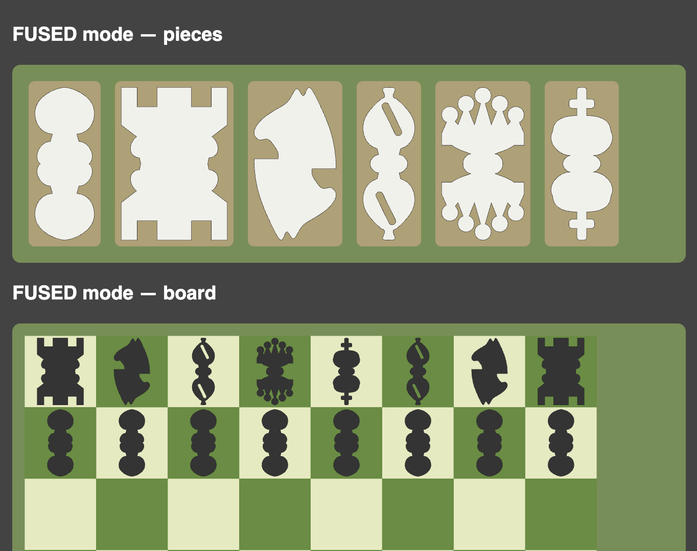

# Parametric 2D Chess Set (build123d)

A complete **2D chessboard and flat chess-piece silhouettes** generated entirely
from Python with [build123d](https://build123d.readthedocs.io). The project
reproduces the classic composition — an 8×8 cream/green board with the standard
opening arrangement, White at the bottom and Black at the top — as stylised flat
symbols rather than sculpted 3D geometry.



Each piece is available in three forms:

1. **Filled 2D face** — for rendering, SVG export, engraving or colouring.
2. **Outline** — closed boundary wires (or an offset ring) for laser cutting / plotting.
3. **Optional thin solid** — the face extruded into a flat token for cutting or 3D printing.

## Quick start

```bash
uv sync
python scripts/generate_all.py      # writes everything under output/
```

That single command regenerates all deliverables:

```
output/
├── svg/   board.svg, <piece>.svg ×6, initial_position.svg
├── dxf/   board.dxf, pieces.dxf, initial_position.dxf
├── step/  board.step, flat_pieces.step
└── stl/   <piece>.stl ×6
```

Flags:

* `--no-solids` — skip the STEP/STL extrusions.
* `--single-sided` — plain one-orientation silhouettes.
* `--fused` — compact point-symmetric figures readable the same way by everyone.
* a positional argument sets the output directory.

```bash
python scripts/generate_all.py my_output --no-solids --fused
```

`python build_model.py` is a root-level shortcut for the same generation step.

## Figure modes

Every piece can be composed three ways, chosen with the `figure_mode` field on
[`ChessStyle`](src/chess2d/parameters.py) (a [`FigureMode`](src/chess2d/parameters.py)):

| Mode | Look | For whom it reads upright |
| --- | --- | --- |
| `SINGLE` | plain one-orientation silhouette | the near player only (upside-down for the opponent) |
| `TWO_SIDED` *(default)* | full figure + its 180° rotation stacked base-to-base, joined by a border neck | each player reads their own end |
| `FUSED` | only the identifying top (head/crown/mitre) merged with its 180° rotation into one compact figure | **everyone** — it is point-symmetric, so it looks the same from every side |

All three are **single connected pieces** — printable / laser-cuttable as one
element — and the two colours are told apart by fill only. `FUSED` fills the
square best (it isn't stretched tall like `TWO_SIDED`) while still being legible
to both players.

```python
from chess2d import ChessStyle, FigureMode, generate_all

generate_all(style=ChessStyle(figure_mode=FigureMode.FUSED))
```

The same `mode` argument is available directly on `make_piece`,
`make_piece_solid` and `make_piece_geometry`.

## Web app (Gradio)

An interactive configurator: pick the figure form, tweak dimensions, watch the
board preview update live, and download all generated files as a ZIP.

```bash
uv sync --extra app
python scripts/app.py
```

Then open the printed URL (default <http://127.0.0.1:7860>). The app lets you:

* choose the **figure form** — two-sided, fused, or single-sided;
* set **square size**, **piece thickness** and **board thickness**;
* **preview** the full starting position plus all six piece silhouettes, live;
* **download** a ZIP with `svg/`, `dxf/`, and (optionally) `step/` + `stl/`.

`--port 7861` picks a port and `--share` creates a public link. Installing the
package also provides a `chess2d-app` console script.

## Previewing

With the optional viewer installed (`uv sync --extra preview`):

```bash
python scripts/preview_set.py          # full board in ocp_vscode
python scripts/preview_set.py pieces   # the six silhouettes side by side
```

## Library usage

```python
from chess2d import make_piece, make_board, make_initial_position, PieceType

pawn   = make_piece(PieceType.PAWN)          # a Sketch face
board  = make_board()                         # light/dark square groups + border
scene  = make_initial_position()              # board + white/black piece layers
```

Piece generators are pure functions: they take a `scale` and return geometry,
never touching the filesystem or the viewer.

```python
from chess2d import make_piece_geometry, make_piece_solid

geom  = make_piece_geometry(PieceType.KNIGHT, with_solid=True)
# geom.fill (Sketch), geom.outline (Shape), geom.optional_solid (Part)

token = make_piece_solid(PieceType.QUEEN, thickness=2.0)   # flat 3D token
```

## Coordinate system & dimensions

* Units: millimetres. Board centred on the origin.
* X: left→right, Y: bottom→top (White at −Y, Black at +Y), Z: out of the board.
* Every piece is authored facing +Y with its local origin at its bounding-box
  centre; Black pieces are placed with a 180° rotation about Z.

Master dimensions live in [`src/chess2d/parameters.py`](src/chess2d/parameters.py)
(`SQUARE_SIZE = 50 mm`, `PLAYING_SIZE = 400 mm`, `BOARD_SIZE = 420 mm`, …) and are
bundled into a tunable [`ChessStyle`](src/chess2d/parameters.py) dataclass.

## Project layout

```
src/chess2d/
├── parameters.py   dimensions, enums (PieceType, Side, FigureMode), ChessStyle
├── geometry.py     low-level helpers (turned profiles, two_sided, fused_two_sided)
├── pieces.py       the six make_* silhouette generators + dispatcher + solids
├── board.py        make_board, make_square, square_center, colour parity
├── assembly.py     place_piece, make_initial_position, BACK_RANK
├── export.py       SVG / DXF / STEP / STL writers + generate_all
├── preview.py      optional ocp_vscode helpers
└── gradio_app.py   the interactive web configurator
scripts/            generate_all.py, preview_set.py, app.py
tests/              test_pieces.py, test_board.py, test_layout.py, test_app.py
```

## Releases (CI)

Pushing a version tag builds and publishes a GitHub release via
[`.github/workflows/release.yml`](.github/workflows/release.yml):

```bash
git tag v1.0.0
git push origin v1.0.0
```

Each release gets, **for all three figure modes**:

* `chess2d-<mode>-<tag>.zip` — the full model set (`svg/`, `dxf/`, `step/`, `stl/`);
* `board-<mode>-<tag>.png` — a rendered image of that board with its figures.

The workflow lints, type-checks and tests first, then verifies every archive
really contains STEP and STL files before publishing. `workflow_dispatch` runs a
dry build that uploads workflow artifacts without creating a release.

Build the same artifacts locally:

```bash
python scripts/build_release.py --version v1.0.0
```

Images need an SVG rasteriser — `cairosvg`, `rsvg-convert` (`librsvg2-bin`, what
CI uses) or `inkscape`; add `--no-images` to skip them.

## Development

```bash
uv run pytest        # geometry / layout / app validation tests
uv run ruff check .  # lint
uv run mypy          # type-check src/chess2d
```

The tests assert the acceptance criteria: every piece resolves to a valid,
in-square face with closed wires; symmetric pieces are symmetric and the knight
is intentionally asymmetric; the board has exactly 32 light + 32 dark squares
with h1 light; and the opening has the correct 16 + 16 piece counts with Black
rotated consistently.
